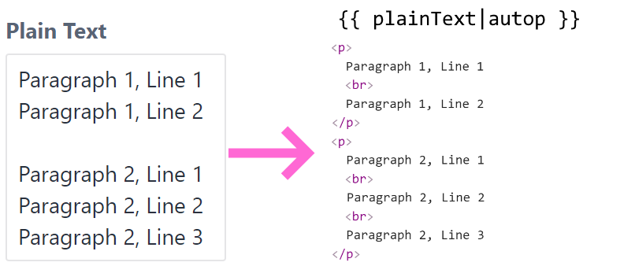

# autop Twig Filter plugin for Craft CMS 3

A Twig filter that strips html and generates paragraphs from newlines.

Useful when you want to use the Plain Text field to generate `
` and ` ` tags.

## Requirements

This plugin requires Craft CMS 3.0.0 or later.

## Installation

To install the plugin, follow these instructions.

1. Open your terminal and go to your Craft project:

`cd /path/to/project`

2. Then tell Composer to load the plugin:

`composer require emandiev/autop-twig-filter`

3. In the Control Panel, go to Settings → Plugins and click the “Install” button for autop Twig Filter.

## Using autop Twig Filter

You can use the `autop` filter without parameters like this:

`{{ entry.plainText|autop }}`

The filter will create `
` tags from consecutive newlines and (by default) ` ` tags from single newlines.

The optional parameter `$br` allows you to disable the ` ` tag creation.

`{{ entry.plainText|autop(false) }}`

The plugin will also register a Twig function that you can use if needed.

``

## Configuring autop Twig Filter

You can create a file named `autop-twig-filter.php` in Craft's `config` folder to change the default parameter values.

For example, you can disable the default ` ` tag creation globally like this:

	<?php
	return [
	    'br' => false,
	];

`{{ entry.plainText|autop }} // will not generate   tags`

## Credits

Brought to you by [Danail Emandiev](https://emandiev.com/)